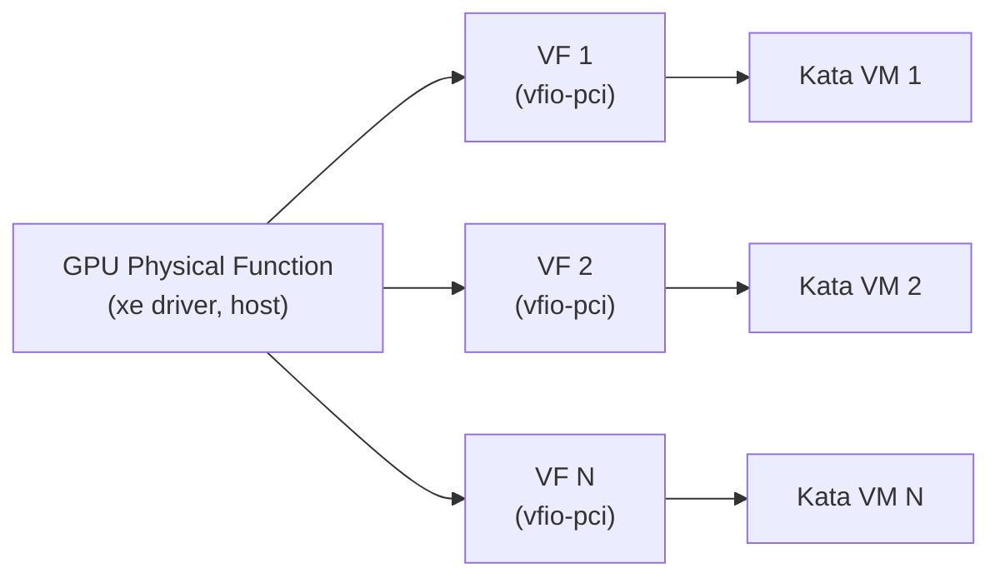

# Intel Xe SR-IOV GPU sharing with Kata Containers

Intel GPUs driven by the `xe` kernel driver can expose SR-IOV Virtual Functions
(VFs). Each VF is a separate PCIe function with its own share of the resources
of the GPU's Physical Function (PF). If you bind the VFs to `vfio-pci`, you can
pass each one to a different Kata Containers VM. One physical GPU can then
serve many isolated workloads.



## Host hardware initialization

The steps below prepare the host: they enable the IOMMU, find the Intel GPU,
create the VFs and hand them over to `vfio-pci`. Each block can be copy-pasted
as is.

**Prerequisites:**

- An Ubuntu host. The commands in this guide assume Ubuntu.
- An Intel GPU with SR-IOV support in the `xe` driver.
- A host kernel with `CONFIG_PCI_IOV`, `CONFIG_DRM_XE`, `CONFIG_VFIO_PCI`,
  `CONFIG_IOMMUFD` and `CONFIG_VFIO_DEVICE_CDEV`. The last two provide
  IOMMUFD-based VFIO device nodes (`/dev/iommu` and `/dev/vfio/devices/vfioN`),
  which this guide uses instead of the legacy VFIO group and container
  interface. Each option must be `y` or `m`. The Ubuntu 24.04 HWE kernel (7.0)
  builds `IOMMUFD` as a module, which Step 3 loads.
- VT-d enabled in the platform firmware (BIOS/UEFI) settings.
- Root privileges. Every step after the reboot runs in a root shell
  (`sudo -i`).

Check the kernel options of the running kernel with:

```bash
grep -E 'CONFIG_(PCI_IOV|DRM_XE|VFIO_PCI|IOMMUFD|VFIO_DEVICE_CDEV)=' /boot/config-"$(uname -r)"
```

### Step 1: Enable the IOMMU on the host kernel command line

Add `intel_iommu=on iommu=pt` to the host kernel command line:

- `intel_iommu=on` turns on the Intel VT-d IOMMU, which VFIO requires.
- `iommu=pt` uses pass-through mappings for devices the host driver owns, such
  as the PF. This avoids an IOMMU translation cost on the host.

```bash
sudo sed -i -E '/^GRUB_CMDLINE_LINUX_DEFAULT=/{/intel_iommu=on/! s/"$/ intel_iommu=on iommu=pt"/}' /etc/default/grub
sudo update-grub
sudo reboot
```

After the reboot, check that the parameters are active and that the IOMMU is
initialized:

```bash
grep -o 'intel_iommu=on\|iommu=pt' /proc/cmdline
ls /sys/class/iommu/
sudo dmesg | grep -i -e DMAR -e IOMMU | head
```

`ls /sys/class/iommu/` lists one or more `dmar*` entries when VT-d is active.
If it is empty, check the firmware VT-d setting.

### Step 2: Find the Intel GPUs and their SR-IOV capacity

List the Intel display-class PCI devices:

```bash
lspci -D -nn -d 8086::0300
lspci -D -nn -d 8086::0380
```

For each Intel GPU PF, the snippet below prints its PCI address (BDF), bound
driver, and SR-IOV limits. It skips VFs that already exist:

```bash
for d in /sys/bus/pci/devices/*; do
    [ "$(cat "$d/vendor")" = "0x8086" ] || continue
    case "$(cat "$d/class")" in 0x03*) ;; *) continue ;; esac
    [ -e "$d/physfn" ] && continue
    drv=none; [ -e "$d/driver" ] && drv=$(basename "$(readlink "$d/driver")")
    printf '%s driver=%s sriov_totalvfs=%s sriov_numvfs=%s\n' \
        "$(basename "$d")" "$drv" \
        "$(cat "$d/sriov_totalvfs" 2>/dev/null || echo n/a)" \
        "$(cat "$d/sriov_numvfs" 2>/dev/null || echo n/a)"
done
```

A usable PF shows `driver=xe` and a `sriov_totalvfs` greater than `0`.
`sriov_totalvfs` is the standard PCI sysfs attribute for the most VFs a PF
supports.

**Warning:** The PF must stay bound to the `xe` driver. The `xe` driver creates
and provisions the VFs, so unbinding the PF destroys them.

### Step 3: Create the VFs and bind them to `vfio-pci`

Set these two variables, then run the script as root:

- `PF_BDF`: the PF from Step 2, for example `0000:03:00.0`. If you leave it
  unset, the script picks the first Intel GPU that is bound to `xe` and
  supports SR-IOV.
- `NUM_VFS`: the number of VFs to create. If you leave it unset, the script
  uses the PF's `sriov_totalvfs`.

```bash
PF_BDF=${PF_BDF:-}   # e.g. 0000:03:00.0
NUM_VFS=${NUM_VFS:-} # e.g. 4; empty = sriov_totalvfs

xe_sriov_setup() {
    modprobe iommufd || return 1
    modprobe vfio-pci || return 1

    if [ -z "$PF_BDF" ]; then
        for d in /sys/bus/pci/devices/*; do
            [ "$(cat "$d/vendor")" = "0x8086" ] || continue
            case "$(cat "$d/class")" in 0x03*) ;; *) continue ;; esac
            [ -e "$d/physfn" ] && continue
            [ "$(basename "$(readlink "$d/driver" 2>/dev/null)")" = "xe" ] || continue
            [ "$(cat "$d/sriov_totalvfs" 2>/dev/null || echo 0)" -gt 0 ] || continue
            PF_BDF=$(basename "$d"); break
        done
    fi
    [ -n "$PF_BDF" ] || { echo "No SR-IOV capable Intel GPU bound to xe found"; return 1; }

    PF=/sys/bus/pci/devices/$PF_BDF
    TOTAL_VFS=$(cat "$PF/sriov_totalvfs")
    NUM_VFS=${NUM_VFS:-$TOTAL_VFS}
    if [ "$NUM_VFS" -lt 1 ] || [ "$NUM_VFS" -gt "$TOTAL_VFS" ]; then
        echo "NUM_VFS must be between 1 and $TOTAL_VFS"; return 1
    fi
    echo "PF: $PF_BDF, creating $NUM_VFS of $TOTAL_VFS VFs"

    echo 0 > "$PF/sriov_drivers_autoprobe"
    echo 0 > "$PF/sriov_numvfs"
    echo "$NUM_VFS" > "$PF/sriov_numvfs" || return 1

    for vf in "$PF"/virtfn*; do
        VF_BDF=$(basename "$(readlink -f "$vf")")
        if [ -e "$vf/driver" ]; then
            drv=$(basename "$(readlink "$vf/driver")")
            [ "$drv" = "vfio-pci" ] && continue
            echo "$VF_BDF" > "/sys/bus/pci/drivers/$drv/unbind"
        fi
        echo vfio-pci > "$vf/driver_override"
        echo "$VF_BDF" > /sys/bus/pci/drivers_probe
    done
}
xe_sriov_setup
```

The script:

- Loads `iommufd` so that `/dev/iommu` exists. This is a no-op when the kernel
  has IOMMUFD built in.
- Sets `sriov_drivers_autoprobe` to `0`, so that the host doesn't bind a driver
  to new VFs on its own. This keeps the `xe` driver from binding VFs on the
  host before they go to `vfio-pci`.
- Sets `sriov_numvfs` to `0` first, because you can only change the VF count
  from `0`. Before you run the script, stop any Kata VMs that use VFs from this
  PF.
- Unbinds a VF that is already bound to another driver (usually `xe`) before
  handing it to `vfio-pci`.

**Note:** The VF configuration does not survive a reboot. Run Step 3 again after
each boot, or put it in a boot-time `systemd` unit.

**If writing `sriov_numvfs` fails**, check that SR-IOV has not been turned off
with the `xe.max_vfs` module parameter:

```bash
sudo cat /sys/module/xe/parameters/max_vfs
```

The default, `4294967295`, means no limit. `0` turns off SR-IOV in the `xe`
driver. `sriov_totalvfs` still shows the hardware limit in that case, but
creating VFs fails. Remove `xe.max_vfs=0` from the kernel command line and from
any `/etc/modprobe.d/` file, then reboot.

### Step 4: Verify

Every VF should use `vfio-pci` and have its own IOMMUFD VFIO device node
(`/dev/vfio/devices/vfioN`). This node, not the legacy `/dev/vfio/<group>`
node, is the path you hand to Kata. Both runtimes switch to the IOMMUFD backend
when the device path is under `/dev/vfio/devices/`.

```bash
test -c /dev/iommu && echo "/dev/iommu: ok"
for vf in /sys/bus/pci/devices/"$PF_BDF"/virtfn*; do
    [ -e "$vf" ] || { echo "No VFs on $PF_BDF"; break; }
    VF_BDF=$(basename "$(readlink -f "$vf")")
    cdev=$(ls "$vf/vfio-dev" 2>/dev/null)
    printf '%s driver=%s iommu_group=%s vfio_cdev=%s\n' "$VF_BDF" \
        "$(basename "$(readlink "$vf/driver")")" \
        "$(basename "$(readlink "$vf/iommu_group")")" \
        "${cdev:+/dev/vfio/devices/$cdev}"
done
ls -l /dev/vfio/devices/
```

The kernel lists the character device of a VFIO-bound device under
`vfio-dev/` in sysfs. If `vfio_cdev` is empty, the kernel lacks
`CONFIG_VFIO_DEVICE_CDEV`.

**Warning:** IOMMUFD gives each device its own node, but the IOMMU group still
sets the isolation boundary. The kernel only allows a device to be opened when
every device in its group is bound to `vfio-pci` (or to no driver). Normally
each VF gets its own group. If several VFs share a group, you cannot assign
them to different Kata VMs.

To tear down the VFs, for example to change their number:

```bash
echo 0 > /sys/bus/pci/devices/"$PF_BDF"/sriov_numvfs
```

## Install Kata Containers

Install the Kata Containers 4.2.0 release. Then replace its `runtime-rs` shim
with a newer build from `main` that includes the fix for Intel GPUs (commit
[`67e2a76`](https://github.com/kata-containers/kata-containers/commit/67e2a76eff964573429e76c7722bd53c62abfd56),
merged in
[#13593](https://github.com/kata-containers/kata-containers/pull/13593)). The
4.2.0 shim makes the Kata agent wait for a CDI device for every Intel GPU
passed to the VM. Nothing in the guest creates that device, so the container
never starts.

**Temporary step:** Kata Containers 4.3.0 will include the fix, and this guide
will then drop the shim replacement. With 4.3.0 or later, install the release
only.

The CI keeps each component's build in
`ghcr.io/kata-containers/cached-artefacts/<component>` as an OCI artifact,
tagged with the `main` commit it was built from. The `runtime-rs` shim lives in
the `shim-v2-rust` component. Its tarball has the shim binary and the
`runtime-rs` configuration files, and unpacks into `/opt/kata` just like the
release tarball.

**Prerequisites:** Docker, plus the `zstd` and `jq` tools used by the scripts
below:

```bash
sudo apt-get install -y zstd jq
```

Download the tarballs as a regular user:

```bash
KATA_VERSION=4.2.0
KATA_RS_COMMIT=caf2339138429dc0dc976b72bb9d8b12ce62dd36

KATA_TMP=$(mktemp -d)
curl -fL -o "$KATA_TMP/kata-static.tar.zst" \
    "https://github.com/kata-containers/kata-containers/releases/download/${KATA_VERSION}/kata-static-${KATA_VERSION}-amd64.tar.zst"
docker run --rm --user "$(id -u):$(id -g)" -v "$KATA_TMP":/workspace -w /workspace \
    ghcr.io/oras-project/oras:v1.3.0 \
    pull "ghcr.io/kata-containers/cached-artefacts/shim-v2-rust:${KATA_RS_COMMIT}-x86_64"
(cd "$KATA_TMP" && sha256sum -c shim-v2-rust-sha256sum)
```

- `KATA_RS_COMMIT` is the upstream merge commit of the fix. You can use any
  later `main` commit whose `shim-v2-rust` build exists in the cache.
- `kata-static` contains the `runtime-rs` shim, the guest kernel and image, and
  the hypervisors. The download is about 1 GB. This guide uses only
  `runtime-rs`, so it doesn't need the Go runtime from the separate
  `kata-go-static` release asset.
- `oras` runs from its container image, so you don't need to install it on the
  host. `--user` makes the downloaded files belong to you rather than root, so
  the final `rm` can delete them. The download is about 15 MB.

If the checksum check prints `OK`, extract both tarballs into `/opt/kata` in
the same shell:

```bash
sudo tar --zstd -xf "$KATA_TMP/kata-static.tar.zst" -C / &&
    sudo tar --zstd -xf "$KATA_TMP/kata-static-shim-v2-rust.tar.zst" -C / --no-same-owner &&
    rm -rf "$KATA_TMP" &&
    /opt/kata/runtime-rs/bin/containerd-shim-kata-v2 --version
```

The files in the CI tarball are owned by the CI user, so `--no-same-owner`
makes the installed files owned by root. The shim tarball goes second, so its
files replace the 4.2.0 ones.

**Why two blocks:** `sudo` reads its password from the terminal. If you paste
commands that follow a `sudo` line, `sudo` reads them as the password and
appears to hang. The second block is a single `&&` chain, so the shell reads
all of it before `sudo` asks for the password.

The shim reports `version: 4.2.0`, because the `VERSION` file only changes at
release time, but its `commit:` field shows the `KATA_RS_COMMIT` build:

```text
Kata Containers containerd shim (Rust): id: io.containerd.kata.v2, version: 4.2.0, commit: caf2339138429dc0dc976b72bb9d8b12ce62dd36
```

**Note:** The newer `configuration-qemu-runtime-rs.toml` refers to the same
guest kernel, image, QEMU and `virtiofsd` paths as 4.2.0, so the 4.2.0 assets
work with it unchanged. If you have edited any file under
`/opt/kata/share/defaults/kata-containers/runtime-rs/`, back it up first,
because the overlay replaces it.

## Build the Intel GPU guest kernel

The default Kata guest kernel doesn't include the `xe` driver, and Kata
Containers releases don't ship a guest kernel with it. Build one with the
Intel GPU kernel fragment (`-g intel`) of `build-kernel.sh`.

Use a Kata Containers source tree newer than 4.2.0, because the `-g intel`
fragment was only fixed after 4.2.0 (it now enables `CONFIG_DRM_XE`). The steps
below use the same commit as the `runtime-rs` shim above.

Install the build dependencies:

```bash
sudo apt-get install -y build-essential flex bison bc libelf-dev libssl-dev gettext-base curl
```

Build as a regular user, and install into `/opt/kata` with `sudo`:

```bash
KATA_RS_COMMIT=caf2339138429dc0dc976b72bb9d8b12ce62dd36

curl -fsSL "https://github.com/kata-containers/kata-containers/archive/${KATA_RS_COMMIT}.tar.gz" | tar -xz
cd "kata-containers-${KATA_RS_COMMIT}/tools/packaging/kernel"

echo "CONFIG_PM=y" >> configs/fragments/gpu/intel.x86_64.conf.in

./build-kernel.sh -g intel setup
./build-kernel.sh -g intel build
sudo env PREFIX=/opt/kata ./build-kernel.sh -g intel install
```

- The `echo` line enables power management (`CONFIG_PM`), which the Kata guest
  kernel is built without. Without it, `xe` ignores the GuC's replies, and the
  VF probe fails with `Timed out wait for G2H` and error `-62`. The Intel GPU
  fragment enables `CONFIG_PM` in later Kata versions.
- `setup` downloads the default Kata guest kernel (the version in
  `versions.yaml`, 6.18 LTS at this commit) from kernel.org, checks its
  checksum, applies the Kata patches, and generates `.config` from the Kata
  fragments plus the Intel GPU fragment
  (`configs/fragments/gpu/intel.x86_64.conf.in`).
- Without `PREFIX=/opt/kata`, `install` puts the kernel under `/usr`.

The install adds the kernel next to the default one, with an `-intel-gpu`
suffix. The existing `vmlinux.container` stays as it is:

```text
/opt/kata/share/kata-containers/vmlinux-6.18.52-204-intel-gpu
/opt/kata/share/kata-containers/vmlinux-intel-gpu.container -> vmlinux-6.18.52-204-intel-gpu
```

The `204` in the name is the Kata kernel config version from
`tools/packaging/kernel/kata_config_version`.

## Configure `runtime-rs` for VF passthrough

Point `runtime-rs` at the Intel GPU guest kernel and set the VFIO options with
a drop-in file, instead of editing the shipped configuration.
`runtime-rs` merges any `.toml` files in the `config.d/` directory next to its
configuration file. For
`/opt/kata/share/defaults/kata-containers/runtime-rs/configuration-qemu-runtime-rs.toml`,
that is `/opt/kata/share/defaults/kata-containers/runtime-rs/config.d/`. For
details, see [Runtime Configuration](../runtime-configuration.md).

Run as root:

```bash
mkdir -p /opt/kata/share/defaults/kata-containers/runtime-rs/config.d
cat > /opt/kata/share/defaults/kata-containers/runtime-rs/config.d/50-intel-xe-vf.toml <<'EOF'
[hypervisor.qemu]
kernel = "/opt/kata/share/kata-containers/vmlinux-intel-gpu.container"
cold_plug_vfio = "root-port"
vm_rootfs_driver = "virtio-blk-pci"
EOF
```

- `kernel` boots the guest with the Xe-enabled kernel built above.
- `cold_plug_vfio = "root-port"` attaches the VFIO device of each VF to a PCIe
  root port before the VM boots. `runtime-rs` picks up the VFIO device nodes
  that Docker adds to the container (for example `/dev/vfio/devices/vfio0`),
  and adds the root ports it needs.
- `vm_rootfs_driver = "virtio-blk-pci"` attaches the guest image as a
  `virtio-blk` device instead of the default NVDIMM (`virtio-pmem`) device.
  VFIO maps all guest memory for DMA, and that fails for the read-only NVDIMM
  backend of the image.

## Configure Docker

Register `runtime-rs` with QEMU as the `kata-rs` Docker runtime. Run as root:

```bash
cat > /tmp/kata-runtimes.json <<'JSON'
{
  "runtimes": {
    "kata-rs": {
      "runtimeType": "/opt/kata/runtime-rs/bin/containerd-shim-kata-v2",
      "options": {
        "ConfigPath": "/opt/kata/share/defaults/kata-containers/runtime-rs/configuration-qemu-runtime-rs.toml"
      }
    }
  }
}
JSON

mkdir -p /etc/docker
if [ -s /etc/docker/daemon.json ]; then
    cp /etc/docker/daemon.json /etc/docker/daemon.json.bak
    jq -s '.[0] * .[1]' /etc/docker/daemon.json.bak /tmp/kata-runtimes.json > /etc/docker/daemon.json
else
    cp /tmp/kata-runtimes.json /etc/docker/daemon.json
fi
rm -f /tmp/kata-runtimes.json

systemctl restart docker
```

If a `daemon.json` already exists, the script backs it up and merges the
runtime into it with `jq`, so your other settings stay.

Check that Docker sees the runtime, and start a container with it:

```bash
docker info --format '{{json .Runtimes}}' | jq 'keys'
docker run --rm --runtime kata-rs busybox uname -r
```

The container prints the guest kernel version (`6.18.52-intel-gpu`) rather than
the host kernel version, which shows that it runs in a Kata VM with the kernel
built above.

## Run containers with the VFs

Pass one VF to each container by its IOMMUFD VFIO node. Step 4 prints the
`/dev/vfio/devices/vfioN` node of each VF:

```bash
docker run --rm --runtime kata-rs \
    --device /dev/vfio/devices/vfio0 \
    -v /dev:/dev \
    busybox sh -c 'ls -l /dev/dri && dmesg | grep "Initialized xe"'
```

- `--device /dev/vfio/devices/vfio0`: Kata passes the VF through to the VM
  with VFIO, and the `xe` driver in the guest kernel binds to it.
- `-v /dev:/dev`: with Kata, this mount gives the container the VM's `/dev`,
  not the host's. This is how the `xe` device nodes that the guest kernel
  creates become visible in the container.

The container sees the VF as a GPU under `/dev/dri`:

```text
total 0
crw-------    1 root     root      226,   0 Sep 29 14:49 card0
crw-------    1 root     root      226, 128 Sep 29 14:49 renderD128
[    0.175794] [drm] Initialized xe 1.1.0 for 0000:02:00.0 on minor 0
```

To share the GPU, start more containers at the same time, each with a
different VF, for example `/dev/vfio/devices/vfio1` for the second one. A VF
can only belong to one VM at a time.

**Warning:** Use `-v /dev:/dev` only with the `kata-rs` runtime. It is only
safe because the container runs in its own VM. With a runtime that is not
VM-based, such as `runc`, the same option gives the container every device
node on the host.

**Note:** The kernel assigns the `vfioN` numbers when the VFs are bound, so they
can change after a reboot or after you run Step 3 again. Run Step 4 again to
find the current numbers.

Support for requesting VFs as
[Container Device Interface (CDI)](https://github.com/cncf-tags/container-device-interface)
devices, with specs from the `cdi-specs-generator` tool of the
[Intel resource drivers for Kubernetes](https://github.com/intel/intel-resource-drivers-for-kubernetes),
is planned for a later version of this guide.
